# Entity Relationship Diagram (ERD) - ThanhHuyStore

## Sơ đồ ERD theo format Mermaid

```mermaid
erDiagram
    %% Core User Management
    User {
        ObjectId id PK
        string name
        string email UK
        boolean emailVerified
        string phoneNumber
        string image
        string hashedPassword
        datetime createAt
        datetime updateAt
        datetime lastLogin
        enum role
        string resetPasswordToken
        datetime resetPasswordExpires
        string emailVerificationToken
        datetime emailVerificationExpires
        array purchasedCategories
        array chatRoomIds FK
        array seenMessageIds FK
    }

    Account {
        ObjectId id PK
        ObjectId userId FK
        string type
        string provider
        string providerAccountId
        string refresh_token
        string access_token
        int expires_at
        string token_type
        string scope
        string id_token
        string session_state
    }

    %% Product Management
    Product {
        ObjectId id PK
        string name
        string description
        string brand
        enum productType
        float price
        ObjectId categoryId FK
        int inStock
        int priority
        datetime createdAt
        datetime updatedAt
        boolean isDeleted
        datetime deletedAt
        string deletedBy
        string thumbnail
        array galleryImages
    }

    Category {
        ObjectId id PK
        string name
        string slug
        string image
        string icon
        string description
        datetime createdAt
        datetime updatedAt
        ObjectId parentId FK
    }

    ProductVariant {
        ObjectId id PK
        ObjectId productId FK
        string sku UK
        json attributes
        float price
        int stock
        string thumbnail
        array galleryImages
        boolean isActive
        datetime createdAt
        datetime updatedAt
    }

    ProductAttribute {
        ObjectId id PK
        ObjectId productId FK
        string name
        string label
        enum type
        enum displayType
        boolean isRequired
        boolean isVariation
        int position
        string description
        datetime createdAt
        datetime updatedAt
    }

    AttributeValue {
        ObjectId id PK
        ObjectId attributeId FK
        string value
        string label
        string description
        string colorCode
        string imageUrl
        float priceAdjustment
        int position
        boolean isActive
        datetime createdAt
        datetime updatedAt
    }

    %% Order Management
    Order {
        ObjectId id PK
        ObjectId userId FK
        float amount
        string currency
        enum status
        enum deliveryStatus
        string paymentIntentId UK
        string phoneNumber
        json address
        string paymentMethod
        float shippingFee
        ObjectId voucherId FK
        string voucherCode
        float discountAmount
        float originalAmount
        string cancelReason
        datetime cancelDate
        datetime createdAt
        datetime updatedAt
        array products
    }

    %% Review System
    Review {
        ObjectId id PK
        ObjectId userId FK
        ObjectId productId FK
        int rating
        string comment
        string reply
        datetime createdDate
        datetime updatedAt
    }

    %% Article System
    Article {
        ObjectId id PK
        ObjectId userId FK
        string title
        string image
        string content
        int viewCount
        datetime createdAt
        datetime updatedAt
        ObjectId categoryId FK
    }

    ArticleCategory {
        ObjectId id PK
        string name
        string slug
        string description
        string icon
        boolean isActive
        datetime createdAt
        datetime updatedAt
    }

    ArticleReview {
        ObjectId id PK
        ObjectId userId FK
        ObjectId articleId FK
        int rating
        string comment
        ObjectId parentId FK
        datetime createdDate
        datetime updatedAt
    }

    %% Voucher & Promotion System
    Voucher {
        ObjectId id PK
        string code UK
        string description
        string image
        enum discountType
        float discountValue
        float minOrderValue
        int quantity
        int usedCount
        int maxUsagePerUser
        datetime startDate
        datetime endDate
        boolean isActive
        enum voucherType
        array targetUserIds
        datetime createdAt
        datetime updatedAt
    }

    UserVoucher {
        ObjectId id PK
        ObjectId userId FK
        ObjectId voucherId FK
        datetime usedAt
        datetime createdAt
        string orderId
        string reservedForOrderId
        datetime reservedAt
    }

    Promotion {
        ObjectId id PK
        string title
        string description
        enum discountType
        float discountValue
        float maxDiscount
        datetime startDate
        datetime endDate
        boolean isActive
        boolean applyToAll
        array productIds
        array categoryIds
        datetime createdAt
        datetime updatedAt
    }

    ProductPromotion {
        ObjectId id PK
        ObjectId productId FK
        ObjectId promotionId FK
        float promotionalPrice
        datetime startDate
        datetime endDate
        boolean isActive
        int priority
        datetime createdAt
        datetime updatedAt
    }

    %% Chat System
    ChatRoom {
        ObjectId id PK
        array userIds FK
        array messageIds FK
        datetime createdAt
        datetime lastMessageAt
        string name
    }

    Message {
        ObjectId id PK
        ObjectId chatroomId FK
        ObjectId senderId FK
        string body
        string image
        datetime createdAt
        array seenIds FK
    }

    %% Notification System
    Notification {
        ObjectId id PK
        ObjectId userId FK
        ObjectId productId FK
        ObjectId orderId FK
        ObjectId messageId FK
        ObjectId fromUserId FK
        enum type
        string title
        string message
        json data
        boolean isRead
        datetime createdAt
        datetime updatedAt
    }

    %% Analytics System
    AnalyticsEvent {
        ObjectId id PK
        ObjectId userId FK
        string sessionId
        enum eventType
        string entityType
        ObjectId entityId FK
        json metadata
        string userAgent
        string ipAddress
        string referrer
        string path
        datetime timestamp
    }

    %% Admin System
    Banner {
        ObjectId id PK
        string name
        string description
        string image
        string imageResponsive
        datetime startDate
        datetime endDate
        string status
        datetime createdAt
        datetime updatedAt
    }

    AdminSettings {
        ObjectId id PK
        boolean discordNotifications
        boolean orderNotifications
        boolean emailNotifications
        boolean pushNotifications
        boolean analyticsTracking
        int sessionTimeout
        boolean lowStockAlerts
        boolean chatbotSupport
        boolean autoVoucherSuggestion
        boolean dailyReports
        int reportInterval
        boolean codPayment
        boolean momoPayment
        boolean stripePayment
        string createdBy
        string updatedBy
        datetime createdAt
        datetime updatedAt
    }

    AuditLog {
        ObjectId id PK
        string eventType
        string category
        string severity
        ObjectId userId FK
        string userEmail
        string userRole
        string ipAddress
        string userAgent
        string description
        json details
        json metadata
        string resourceId
        string resourceType
        json oldValue
        json newValue
        datetime timestamp
        datetime createdAt
    }

    ReportLog {
        ObjectId id PK
        string type
        float interval
        boolean success
        datetime sentAt
        string error
        datetime createdAt
    }

    %% Relationships
    %% User Management Relationships
    User ||--o{ Account : "has"
    User ||--o{ Order : "places"
    User ||--o{ Review : "writes"
    User ||--o{ ArticleReview : "writes"
    User ||--o{ Notification : "receives"
    User ||--o{ Notification : "sends"
    User ||--o{ UserVoucher : "has"
    User ||--o{ AnalyticsEvent : "generates"
    User ||--o{ Message : "sends"
    User ||--o{ ChatRoom : "participates"
    User ||--o{ AuditLog : "triggers"

    %% Product Management Relationships
    Category ||--o{ Category : "has_subcategories"
    Category ||--o{ Product : "contains"
    Category ||--o{ Article : "categorizes"

    Product ||--o{ ProductVariant : "has_variants"
    Product ||--o{ ProductAttribute : "has_attributes"
    Product ||--o{ Review : "receives"
    Product ||--o{ ProductPromotion : "has_promotions"
    Product ||--o{ Notification : "triggers"

    ProductAttribute ||--o{ AttributeValue : "has_values"

    %% Order Management Relationships
    Order }o--|| User : "belongs_to"
    Order }o--o| Voucher : "uses"

    %% Voucher & Promotion Relationships
    Voucher ||--o{ UserVoucher : "assigned_to"
    Voucher ||--o{ Order : "applied_to"

    UserVoucher }o--|| User : "belongs_to"
    UserVoucher }o--|| Voucher : "references"

    Promotion ||--o{ ProductPromotion : "applies_to"
    ProductPromotion }o--|| Product : "targets"
    ProductPromotion }o--|| Promotion : "implements"

    %% Article System Relationships
    ArticleCategory ||--o{ Article : "categorizes"
    Article ||--o{ ArticleReview : "receives"
    ArticleReview }o--|| User : "written_by"
    ArticleReview }o--|| Article : "reviews"
    ArticleReview ||--o{ ArticleReview : "has_replies"

    %% Chat System Relationships
    ChatRoom ||--o{ Message : "contains"
    ChatRoom ||--o{ User : "includes"
    Message }o--|| ChatRoom : "sent_in"
    Message }o--|| User : "sent_by"
    Message ||--o{ User : "seen_by"

    %% Notification Relationships
    Notification }o--o| User : "sent_to"
    Notification }o--o| User : "sent_from"
    Notification }o--o| Product : "about"

    %% Analytics Relationships
    AnalyticsEvent }o--o| User : "tracked_for"
```

## Hướng dẫn sử dụng

### 1. Xem sơ đồ trực tuyến

Truy cập [Mermaid Live Editor](https://mermaid.live/) và copy nội dung trong khối `mermaid` để xem sơ đồ tương tác.

### 2. Các ký hiệu trong sơ đồ

- **PK**: Primary Key (Khóa chính)
- **FK**: Foreign Key (Khóa ngoại)
- **UK**: Unique Key (Khóa duy nhất)
- **||--o{**: One-to-Many relationship (Quan hệ một-nhiều)
- **}o--||**: Many-to-One relationship (Quan hệ nhiều-một)
- **}o--o|**: Many-to-One optional (Quan hệ nhiều-một tùy chọn)

### 3. Các nhóm chức năng chính

#### 🔐 User Management (Quản lý người dùng)

- **User**: Thông tin người dùng cơ bản
- **Account**: Tài khoản OAuth (Google, Facebook, etc.)

#### 🛍️ Product Management (Quản lý sản phẩm)

- **Product**: Sản phẩm chính
- **Category**: Danh mục sản phẩm (hỗ trợ phân cấp)
- **ProductVariant**: Biến thể sản phẩm (màu sắc, dung lượng, etc.)
- **ProductAttribute**: Thuộc tính sản phẩm
- **AttributeValue**: Giá trị thuộc tính

#### 📦 Order Management (Quản lý đơn hàng)

- **Order**: Đơn hàng
- **CartProductType**: Sản phẩm trong giỏ hàng (embedded type)

#### ⭐ Review System (Hệ thống đánh giá)

- **Review**: Đánh giá sản phẩm
- **ArticleReview**: Đánh giá bài viết (hỗ trợ reply)

#### 📰 Article System (Hệ thống bài viết)

- **Article**: Bài viết/tin tức
- **ArticleCategory**: Danh mục bài viết

#### 🎫 Voucher & Promotion (Khuyến mãi)

- **Voucher**: Mã giảm giá
- **UserVoucher**: Voucher của người dùng
- **Promotion**: Chương trình khuyến mãi
- **ProductPromotion**: Khuyến mãi áp dụng cho sản phẩm

#### 💬 Chat System (Hệ thống chat)

- **ChatRoom**: Phòng chat
- **Message**: Tin nhắn

#### 🔔 Notification System (Hệ thống thông báo)

- **Notification**: Thông báo

#### 📊 Analytics System (Hệ thống phân tích)

- **AnalyticsEvent**: Sự kiện phân tích

#### ⚙️ Admin System (Hệ thống quản trị)

- **Banner**: Banner quảng cáo
- **AdminSettings**: Cài đặt hệ thống
- **AuditLog**: Nhật ký kiểm toán
- **ReportLog**: Nhật ký báo cáo

### 4. Đặc điểm kỹ thuật

#### Database: MongoDB

- Sử dụng ObjectId làm primary key
- Hỗ trợ embedded documents và arrays
- Flexible schema với JSON fields

#### Soft Delete

- Product model hỗ trợ soft delete với các field:
  - `isDeleted`: Boolean flag
  - `deletedAt`: Timestamp
  - `deletedBy`: User ID

#### Audit Trail

- **AuditLog**: Theo dõi tất cả hoạt động quan trọng
- Phân loại theo category: ADMIN, SECURITY, BUSINESS, SYSTEM
- Mức độ nghiêm trọng: LOW, MEDIUM, HIGH, CRITICAL

#### Product Variant System

- Hỗ trợ sản phẩm đơn giản (SIMPLE) và sản phẩm có biến thể (VARIANT)
- Flexible attribute system với nhiều loại hiển thị
- Price adjustment cho từng attribute value

### 5. Cập nhật sơ đồ

Khi có thay đổi trong schema Prisma, cần cập nhật file này:

1. Mở file `prisma/schema.prisma`
2. Cập nhật các entity và relationship trong sơ đồ Mermaid
3. Test sơ đồ tại [Mermaid Live Editor](https://mermaid.live/)
4. Commit changes

---

**Lưu ý**: Sơ đồ này được tự động tạo từ Prisma schema. Để đảm bảo tính chính xác, hãy kiểm tra file `prisma/schema.prisma` cho thông tin mới nhất.
