# Sơ đồ Mức Luận Lý (Logical Level) - ThanhHuyStore

## Sơ đồ ERD mức luận lý theo format Mermaid

```mermaid
erDiagram
    %% Core Entities với Primary Keys và Foreign Keys

    USER {
        ObjectId _id PK
        string name
        string email UK
        boolean emailVerified
        string phoneNumber
        string image
        string hashedPassword
        datetime createdAt
        datetime updatedAt
        datetime lastLogin
        enum role
        string resetPasswordToken
        datetime resetPasswordExpires
        string emailVerificationToken
        datetime emailVerificationExpires
        ObjectId_array purchasedCategories
        ObjectId_array chatRoomIds
        ObjectId_array seenMessageIds
    }

    ACCOUNT {
        ObjectId _id PK
        ObjectId userId FK
        string type
        string provider
        string providerAccountId
        string refresh_token
        string access_token
        int expires_at
        string token_type
        string scope
        string id_token
        string session_state
    }

    CATEGORY {
        ObjectId _id PK
        string name
        string slug UK
        string image
        string icon
        string description
        datetime createdAt
        datetime updatedAt
        ObjectId parentId FK
    }

    PRODUCT {
        ObjectId _id PK
        string name
        string description
        string brand
        enum productType
        float price
        ObjectId categoryId FK
        int inStock
        int priority
        datetime createdAt
        datetime updatedAt
        boolean isDeleted
        datetime deletedAt
        string deletedBy
        string thumbnail
        string_array galleryImages
    }

    PRODUCT_VARIANT {
        ObjectId _id PK
        ObjectId productId FK
        string sku UK
        json attributes
        float price
        int stock
        string thumbnail
        string_array galleryImages
        boolean isActive
        datetime createdAt
        datetime updatedAt
    }

    PRODUCT_ATTRIBUTE {
        ObjectId _id PK
        ObjectId productId FK
        string name
        string label
        enum type
        enum displayType
        boolean isRequired
        boolean isVariation
        int position
        string description
        datetime createdAt
        datetime updatedAt
    }

    ATTRIBUTE_VALUE {
        ObjectId _id PK
        ObjectId attributeId FK
        string value
        string label
        string description
        string colorCode
        string imageUrl
        float priceAdjustment
        int position
        boolean isActive
        datetime createdAt
        datetime updatedAt
    }

    ORDER {
        ObjectId _id PK
        ObjectId userId FK
        float amount
        string currency
        enum status
        enum deliveryStatus
        string paymentIntentId UK
        string phoneNumber
        json address
        string paymentMethod
        float shippingFee
        ObjectId voucherId FK
        string voucherCode
        float discountAmount
        float originalAmount
        string cancelReason
        datetime cancelDate
        datetime createdAt
        datetime updatedAt
        json_array products
    }

    REVIEW {
        ObjectId _id PK
        ObjectId userId FK
        ObjectId productId FK
        int rating
        string comment
        string reply
        datetime createdDate
        datetime updatedAt
    }

    VOUCHER {
        ObjectId _id PK
        string code UK
        string description
        string image
        enum discountType
        float discountValue
        float minOrderValue
        int quantity
        int usedCount
        int maxUsagePerUser
        datetime startDate
        datetime endDate
        boolean isActive
        enum voucherType
        ObjectId_array targetUserIds
        datetime createdAt
        datetime updatedAt
    }

    USER_VOUCHER {
        ObjectId _id PK
        ObjectId userId FK
        ObjectId voucherId FK
        datetime usedAt
        datetime createdAt
        string orderId
        string reservedForOrderId
        datetime reservedAt
    }

    PROMOTION {
        ObjectId _id PK
        string title
        string description
        enum discountType
        float discountValue
        float maxDiscount
        datetime startDate
        datetime endDate
        boolean isActive
        boolean applyToAll
        ObjectId_array productIds
        ObjectId_array categoryIds
        datetime createdAt
        datetime updatedAt
    }

    PRODUCT_PROMOTION {
        ObjectId _id PK
        ObjectId productId FK
        ObjectId promotionId FK
        float promotionalPrice
        datetime startDate
        datetime endDate
        boolean isActive
        int priority
        datetime createdAt
        datetime updatedAt
    }

    ARTICLE {
        ObjectId _id PK
        ObjectId userId FK
        string title
        string image
        string content
        int viewCount
        datetime createdAt
        datetime updatedAt
        ObjectId categoryId FK
    }

    ARTICLE_CATEGORY {
        ObjectId _id PK
        string name
        string slug UK
        string description
        string icon
        boolean isActive
        datetime createdAt
        datetime updatedAt
    }

    ARTICLE_REVIEW {
        ObjectId _id PK
        ObjectId userId FK
        ObjectId articleId FK
        int rating
        string comment
        ObjectId parentId FK
        datetime createdDate
        datetime updatedAt
    }

    CHAT_ROOM {
        ObjectId _id PK
        ObjectId_array userIds
        ObjectId_array messageIds
        datetime createdAt
        datetime lastMessageAt
        string name
    }

    MESSAGE {
        ObjectId _id PK
        ObjectId chatroomId FK
        ObjectId senderId FK
        string body
        string image
        datetime createdAt
        ObjectId_array seenIds
    }

    NOTIFICATION {
        ObjectId _id PK
        ObjectId userId FK
        ObjectId productId FK
        ObjectId orderId FK
        ObjectId messageId FK
        ObjectId fromUserId FK
        enum type
        string title
        string message
        json data
        boolean isRead
        datetime createdAt
        datetime updatedAt
    }

    ANALYTICS_EVENT {
        ObjectId _id PK
        ObjectId userId FK
        string sessionId
        enum eventType
        string entityType
        ObjectId entityId FK
        json metadata
        string userAgent
        string ipAddress
        string referrer
        string path
        datetime timestamp
    }

    BANNER {
        ObjectId _id PK
        string name
        string description
        string image
        string imageResponsive
        datetime startDate
        datetime endDate
        string status
        datetime createdAt
        datetime updatedAt
    }

    ADMIN_SETTINGS {
        ObjectId _id PK
        boolean discordNotifications
        boolean orderNotifications
        boolean emailNotifications
        boolean pushNotifications
        boolean analyticsTracking
        int sessionTimeout
        boolean lowStockAlerts
        boolean chatbotSupport
        boolean autoVoucherSuggestion
        boolean dailyReports
        int reportInterval
        boolean codPayment
        boolean momoPayment
        boolean stripePayment
        string createdBy
        string updatedBy
        datetime createdAt
        datetime updatedAt
    }

    AUDIT_LOG {
        ObjectId _id PK
        string eventType
        string category
        string severity
        ObjectId userId FK
        string userEmail
        string userRole
        string ipAddress
        string userAgent
        string description
        json details
        json metadata
        string resourceId
        string resourceType
        json oldValue
        json newValue
        datetime timestamp
        datetime createdAt
    }

    REPORT_LOG {
        ObjectId _id PK
        string type
        float interval
        boolean success
        datetime sentAt
        string error
        datetime createdAt
    }

    %% Relationships - Mức luận lý với cardinality rõ ràng

    %% User Management
    USER ||--o{ ACCOUNT : "1:N - User có nhiều Account OAuth"
    USER ||--o{ ORDER : "1:N - User đặt nhiều Order"
    USER ||--o{ REVIEW : "1:N - User viết nhiều Review"
    USER ||--o{ ARTICLE_REVIEW : "1:N - User viết nhiều ArticleReview"
    USER ||--o{ ARTICLE : "1:N - User tạo nhiều Article"
    USER ||--o{ USER_VOUCHER : "1:N - User có nhiều UserVoucher"
    USER ||--o{ NOTIFICATION : "1:N - User nhận nhiều Notification"
    USER ||--o{ NOTIFICATION : "1:N - User gửi nhiều Notification"
    USER ||--o{ MESSAGE : "1:N - User gửi nhiều Message"
    USER ||--o{ ANALYTICS_EVENT : "1:N - User tạo nhiều AnalyticsEvent"
    USER ||--o{ AUDIT_LOG : "1:N - User tạo nhiều AuditLog"

    %% Product Management
    CATEGORY ||--o{ CATEGORY : "1:N - Category có nhiều SubCategory"
    CATEGORY ||--o{ PRODUCT : "1:N - Category chứa nhiều Product"
    ARTICLE_CATEGORY ||--o{ ARTICLE : "1:N - ArticleCategory chứa nhiều Article"

    PRODUCT ||--o{ PRODUCT_VARIANT : "1:N - Product có nhiều ProductVariant"
    PRODUCT ||--o{ PRODUCT_ATTRIBUTE : "1:N - Product có nhiều ProductAttribute"
    PRODUCT ||--o{ REVIEW : "1:N - Product nhận nhiều Review"
    PRODUCT ||--o{ PRODUCT_PROMOTION : "1:N - Product có nhiều ProductPromotion"

    PRODUCT_ATTRIBUTE ||--o{ ATTRIBUTE_VALUE : "1:N - ProductAttribute có nhiều AttributeValue"

    %% Order & Voucher Management
    ORDER }o--|| USER : "N:1 - Order thuộc về User"
    ORDER }o--o| VOUCHER : "N:1 - Order có thể sử dụng Voucher"

    VOUCHER ||--o{ USER_VOUCHER : "1:N - Voucher được gán cho nhiều UserVoucher"
    VOUCHER ||--o{ ORDER : "1:N - Voucher được áp dụng cho nhiều Order"

    USER_VOUCHER }o--|| USER : "N:1 - UserVoucher thuộc về User"
    USER_VOUCHER }o--|| VOUCHER : "N:1 - UserVoucher tham chiếu Voucher"

    %% Promotion System
    PROMOTION ||--o{ PRODUCT_PROMOTION : "1:N - Promotion áp dụng cho nhiều ProductPromotion"
    PRODUCT_PROMOTION }o--|| PRODUCT : "N:1 - ProductPromotion target Product"
    PRODUCT_PROMOTION }o--|| PROMOTION : "N:1 - ProductPromotion implement Promotion"

    %% Article System
    ARTICLE }o--|| USER : "N:1 - Article được tạo bởi User"
    ARTICLE }o--|| ARTICLE_CATEGORY : "N:1 - Article thuộc ArticleCategory"
    ARTICLE ||--o{ ARTICLE_REVIEW : "1:N - Article nhận nhiều ArticleReview"
    ARTICLE_REVIEW }o--|| USER : "N:1 - ArticleReview được viết bởi User"
    ARTICLE_REVIEW ||--o{ ARTICLE_REVIEW : "1:N - ArticleReview có nhiều Reply"

    %% Chat System
    CHAT_ROOM ||--o{ MESSAGE : "1:N - ChatRoom chứa nhiều Message"
    MESSAGE }o--|| CHAT_ROOM : "N:1 - Message thuộc ChatRoom"
    MESSAGE }o--|| USER : "N:1 - Message được gửi bởi User"

    %% Notification System
    NOTIFICATION }o--o| USER : "N:1 - Notification gửi đến User"
    NOTIFICATION }o--o| USER : "N:1 - Notification gửi từ User"
    NOTIFICATION }o--o| PRODUCT : "N:1 - Notification về Product"
    NOTIFICATION }o--o| ORDER : "N:1 - Notification về Order"
    NOTIFICATION }o--o| MESSAGE : "N:1 - Notification về Message"

    %% Analytics System
    ANALYTICS_EVENT }o--o| USER : "N:1 - AnalyticsEvent được track cho User"

    %% Admin System
    AUDIT_LOG }o--o| USER : "N:1 - AuditLog được tạo bởi User"
```



## Đặc điểm của Sơ đồ Mức Luận Lý

### 🎯 **Khác biệt với Mức Ý Niệm**

| Đặc điểm          | Mức Ý Niệm (Conceptual)     | Mức Luận Lý (Logical)                          |
| ----------------- | --------------------------- | ---------------------------------------------- |
| **Mục đích**      | Mô tả business requirements | Thiết kế cấu trúc database                     |
| **Chi tiết**      | High-level entities         | Detailed attributes với data types             |
| **Keys**          | Không có                    | Primary Keys, Foreign Keys, Unique Keys        |
| **Data Types**    | Không cụ thể                | Cụ thể (ObjectId, string, int, datetime, etc.) |
| **Relationships** | Conceptual relationships    | Cardinality rõ ràng (1:1, 1:N, N:M)            |
| **Platform**      | Database-independent        | MongoDB-specific                               |

### 🔑 **Quy ước đặt tên**

#### **Entities (Tables)**

- Sử dụng **UPPER_CASE** với underscore
- Tên số ít: `USER`, `PRODUCT`, `ORDER`
- Tên có ý nghĩa rõ ràng

#### **Attributes (Fields)**

- **Primary Key**: `_id PK` (MongoDB convention)
- **Foreign Key**: `userId FK`, `productId FK`
- **Unique Key**: `email UK`, `code UK`
- **Array fields**: `ObjectId_array`, `string_array`
- **JSON fields**: `json`, `json_array`

#### **Data Types**

- `ObjectId`: MongoDB ObjectId
- `string`: Text data
- `int`: Integer numbers
- `float`: Decimal numbers
- `boolean`: True/false values
- `datetime`: Date and time
- `enum`: Enumerated values
- `json`: JSON objects

### 📊 **Cardinality Notation**

| Ký hiệu      | Ý nghĩa              | Ví dụ                   |
| ------------ | -------------------- | ----------------------- |
| `\|\|--o{`   | One-to-Many (1:N)    | USER \|\|--o{ ORDER     |
| `}o--\|\|`   | Many-to-One (N:1)    | ORDER }o--\|\| USER     |
| `\|\|--\|\|` | One-to-One (1:1)     | USER \|\|--\|\| PROFILE |
| `}o--o{`     | Many-to-Many (N:M)   | PRODUCT }o--o{ CATEGORY |
| `}o--o\|`    | Many-to-One Optional | ORDER }o--o\| VOUCHER   |

### 🗂️ **Nhóm Entities theo Chức năng**

#### **👤 User Management**

- `USER`: Thông tin người dùng
- `ACCOUNT`: OAuth accounts (Google, Facebook)

#### **🛍️ Product Catalog**

- `CATEGORY`: Danh mục sản phẩm (hierarchical)
- `PRODUCT`: Sản phẩm chính
- `PRODUCT_VARIANT`: Biến thể sản phẩm
- `PRODUCT_ATTRIBUTE`: Thuộc tính sản phẩm
- `ATTRIBUTE_VALUE`: Giá trị thuộc tính

#### **📦 Order Processing**

- `ORDER`: Đơn hàng
- `REVIEW`: Đánh giá sản phẩm

#### **🎫 Promotion System**

- `VOUCHER`: Mã giảm giá
- `USER_VOUCHER`: Voucher của user
- `PROMOTION`: Chương trình khuyến mãi
- `PRODUCT_PROMOTION`: Khuyến mãi sản phẩm

#### **📰 Content Management**

- `ARTICLE`: Bài viết/tin tức
- `ARTICLE_CATEGORY`: Danh mục bài viết
- `ARTICLE_REVIEW`: Đánh giá bài viết

#### **💬 Communication**

- `CHAT_ROOM`: Phòng chat
- `MESSAGE`: Tin nhắn
- `NOTIFICATION`: Thông báo

#### **📈 Analytics & Admin**

- `ANALYTICS_EVENT`: Sự kiện phân tích
- `BANNER`: Banner quảng cáo
- `ADMIN_SETTINGS`: Cài đặt hệ thống
- `AUDIT_LOG`: Nhật ký kiểm toán
- `REPORT_LOG`: Nhật ký báo cáo

### 🔧 **Đặc điểm Kỹ thuật MongoDB**

#### **ObjectId References**

```javascript
// Foreign Key trong MongoDB
{
  _id: ObjectId("..."),
  userId: ObjectId("..."), // Reference to USER._id
  productId: ObjectId("...") // Reference to PRODUCT._id
}
```

#### **Array Fields**

```javascript
// Array of ObjectIds
{
  _id: ObjectId("..."),
  userIds: [ObjectId("..."), ObjectId("...")], // Multiple references
  galleryImages: ["image1.jpg", "image2.jpg"] // Array of strings
}
```

#### **Embedded Documents**

```javascript
// JSON fields for complex data
{
  _id: ObjectId("..."),
  address: { // JSON object
    street: "123 Main St",
    city: "Ho Chi Minh",
    country: "Vietnam"
  },
  products: [ // JSON array
    {
      productId: ObjectId("..."),
      quantity: 2,
      price: 1000000
    }
  ]
}
```

### 🚀 **Sử dụng Sơ đồ**

1. **Database Design**: Sử dụng để thiết kế collections trong MongoDB
2. **API Development**: Reference cho việc tạo API endpoints
3. **Data Migration**: Hướng dẫn cho việc migrate data
4. **Documentation**: Tài liệu cho developers và stakeholders

### 📝 **Cập nhật Sơ đồ**

Khi có thay đổi trong Prisma schema:

1. Cập nhật entities và attributes
2. Kiểm tra relationships và cardinality
3. Validate với MongoDB conventions
4. Test trên [Mermaid Live Editor](https://mermaid.live/)

---

**Lưu ý**: Sơ đồ này được tạo từ Prisma schema và tuân theo MongoDB conventions. Để có thông tin mới nhất, tham khảo file `prisma/schema.prisma`.
