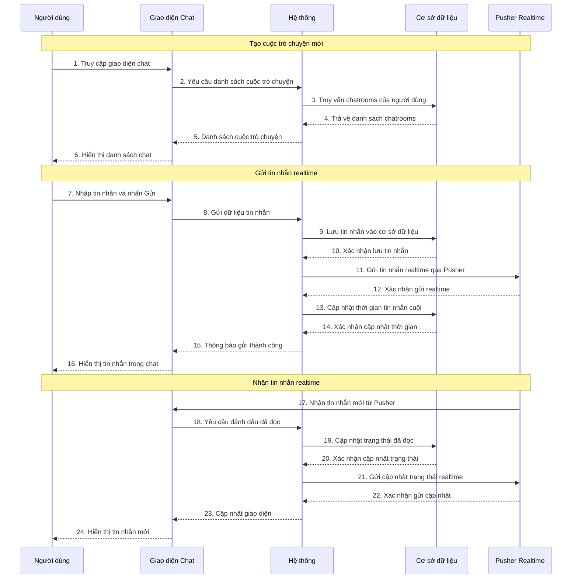
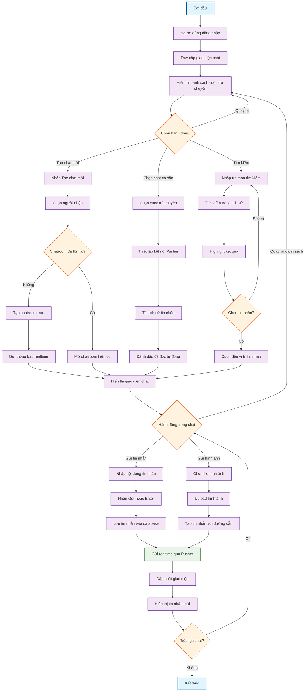

# 1. Use case chi tiết chat nội bộ

**Tên Use case:** Chat nội bộ

**Actor:** Quản trị viên, Khách hàng

**Mô tả:** Hệ thống chat realtime cho phép khách hàng và quản trị viên trao đổi trực tiếp thông qua tin nhắn văn bản và hình ảnh.

**Pre-conditions:**

- Người dùng đã đăng nhập vào hệ thống
- Kết nối internet ổn định để sử dụng tính năng realtime

**Post-conditions:**

- **Success:** Tin nhắn được gửi và nhận thành công, trạng thái đã đọc được cập nhật
- **Fail:** Hệ thống hiển thị thông báo lỗi

**Luồng sự kiện chính:**

1. Người dùng truy cập giao diện chat
2. Hệ thống hiển thị danh sách cuộc trò chuyện
3. Người dùng chọn cuộc trò chuyện hoặc tạo mới
4. Hệ thống thiết lập kết nối realtime và hiển thị tin nhắn

**Include Use Case:** Đăng nhập

**Extend Use Case:**

- Tạo cuộc trò chuyện mới
- Gửi tin nhắn văn bản
- Gửi hình ảnh đính kèm
- Đánh dấu đã đọc tin nhắn
- Tìm kiếm tin nhắn

**Luồng sự kiện phụ:**
Người dùng thực hiện chức năng khác, hệ thống duy trì kết nối chat ở chế độ nền.

## `<Extend Use Case>`

### Tạo cuộc trò chuyện mới

**Actor:** Khách hàng, Quản trị viên

1. Actor nhấn nút Tạo chat mới
2. Actor chọn người nhận từ danh sách
3. Hệ thống kiểm tra cuộc trò chuyện đã tồn tại
4. Nếu chưa có, hệ thống tạo chatroom mới
5. Hệ thống gửi thông báo realtime cho người nhận
6. Hệ thống hiển thị giao diện chat

### Gửi tin nhắn văn bản

**Actor:** Khách hàng, Quản trị viên

1. Actor nhập nội dung tin nhắn vào ô chat
2. Actor nhấn Enter hoặc nút Gửi
3. Hệ thống lưu tin nhắn vào cơ sở dữ liệu
4. Hệ thống gửi tin nhắn realtime qua Pusher
5. Hệ thống cập nhật thời gian tin nhắn cuối
6. Hệ thống hiển thị tin nhắn trong giao diện

### Gửi hình ảnh đính kèm

**Actor:** Khách hàng, Quản trị viên

1. Actor nhấn nút đính kèm hình ảnh
2. Actor chọn file hình ảnh từ thiết bị
3. Hệ thống upload hình ảnh lên server
4. Hệ thống tạo tin nhắn với đường dẫn hình ảnh
5. Hệ thống gửi tin nhắn realtime
6. Hệ thống hiển thị hình ảnh trong chat

### Đánh dấu đã đọc tin nhắn

**Actor:** Khách hàng, Quản trị viên

1. Actor mở cuộc trò chuyện
2. Hệ thống tự động đánh dấu tin nhắn cuối là đã đọc
3. Hệ thống cập nhật danh sách người đã đọc
4. Hệ thống gửi cập nhật realtime cho người gửi
5. Hệ thống hiển thị trạng thái đã đọc

### Tìm kiếm tin nhắn

**Actor:** Khách hàng, Quản trị viên

1. Actor nhập từ khóa vào ô tìm kiếm
2. Hệ thống tìm kiếm trong lịch sử tin nhắn
3. Hệ thống highlight các tin nhắn phù hợp
4. Actor chọn tin nhắn để xem chi tiết
5. Hệ thống cuộn đến vị trí tin nhắn được chọn

## `<Include Use Case>`

### Đăng nhập

**Actor:** Khách hàng, Quản trị viên

1. Actor nhập thông tin đăng nhập
2. Actor nhấn nút Đăng nhập
3. Hệ thống kiểm tra thông tin
4. Nếu hợp lệ, chuyển đến giao diện chat
5. Nếu không hợp lệ, hiển thị thông báo lỗi

# 2. Sơ đồ tuần tự chat nội bộ

**Lưu ý:** Vẽ bằng Mermaid

# 3. Sơ đồ hoạt động chat nội bộ

**Lưu ý:** Vẽ bằng Mermaid
