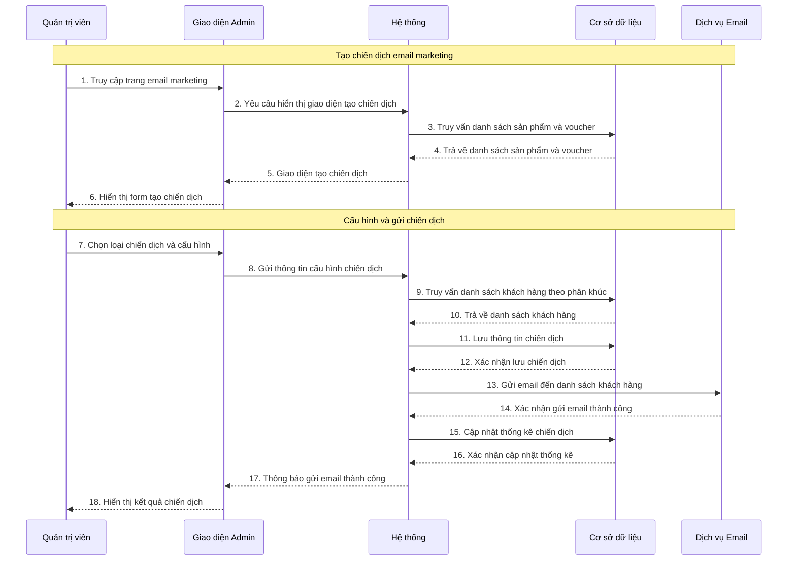
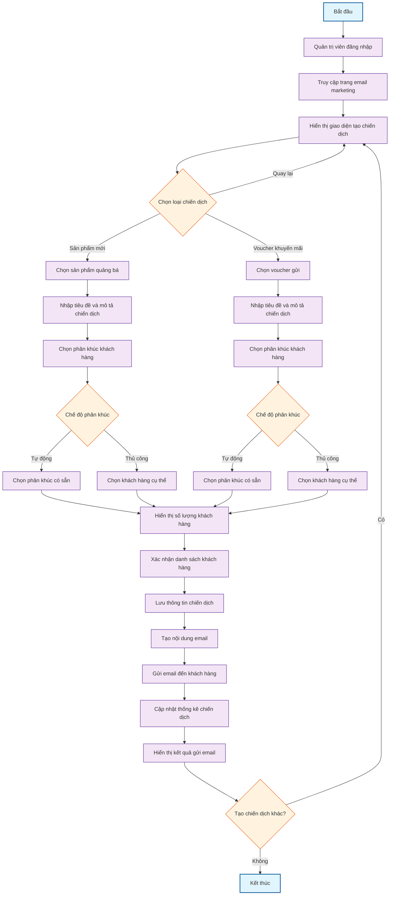

# 1. Use case chi tiết email marketing

**Tên Use case:** Email Marketing

**Actor:** Quản trị viên

**Mô tả:** Quản trị viên tạo và gửi các chiến dịch email marketing đến khách hàng để quảng bá sản phẩm mới và voucher khuyến mãi.

**Pre-conditions:**

- Quản trị viên đã đăng nhập vào hệ thống
- Có danh sách khách hàng trong cơ sở dữ liệu
- Có sản phẩm hoặc voucher để quảng bá

**Post-conditions:**

- **Success:** Email marketing được gửi thành công đến khách hàng, chiến dịch được lưu trữ
- **Fail:** Hệ thống hiển thị thông báo lỗi

**Luồng sự kiện chính:**

1. Quản trị viên chọn chức năng "Email Marketing"
2. Hệ thống hiển thị giao diện tạo chiến dịch
3. Quản trị viên cấu hình chiến dịch và chọn đối tượng
4. Hệ thống gửi email và lưu thống kê chiến dịch

**Include Use Case:** Đăng nhập

**Extend Use Case:**

- Tạo chiến dịch sản phẩm mới
- Tạo chiến dịch voucher khuyến mãi
- Chọn phân khúc khách hàng
- Theo dõi thống kê chiến dịch

**Luồng sự kiện phụ:**
Quản trị viên thực hiện chức năng khác, hệ thống điều hướng sang giao diện tương ứng.

## <Extend Use Case>

### Tạo chiến dịch sản phẩm mới

**Actor:** Quản trị viên

1. Actor chọn loại chiến dịch "Sản phẩm mới"
2. Actor chọn sản phẩm cần quảng bá
3. Actor nhập tiêu đề và mô tả chiến dịch
4. Actor chọn phân khúc khách hàng mục tiêu
5. Hệ thống tạo nội dung email với thông tin sản phẩm
6. Hệ thống gửi email đến danh sách khách hàng được chọn

### Tạo chiến dịch voucher khuyến mãi

**Actor:** Quản trị viên

1. Actor chọn loại chiến dịch "Voucher khuyến mãi"
2. Actor chọn các voucher cần gửi
3. Actor nhập tiêu đề và mô tả chiến dịch
4. Actor chọn phân khúc khách hàng mục tiêu
5. Hệ thống tạo nội dung email với thông tin voucher
6. Hệ thống gửi email đến danh sách khách hàng được chọn

### Chọn phân khúc khách hàng

**Actor:** Quản trị viên

1. Actor chọn chế độ phân khúc (tự động hoặc thủ công)
2. Nếu tự động: Actor chọn các phân khúc có sẵn (VIP, mới, có nguy cơ rời bỏ)
3. Nếu thủ công: Actor chọn từng khách hàng cụ thể
4. Hệ thống hiển thị số lượng khách hàng được chọn
5. Actor xác nhận danh sách khách hàng

### Theo dõi thống kê chiến dịch

**Actor:** Quản trị viên

1. Actor truy cập trang thống kê chiến dịch
2. Hệ thống hiển thị danh sách các chiến dịch đã gửi
3. Actor chọn chiến dịch cần xem chi tiết
4. Hệ thống hiển thị thống kê: số email gửi, tỷ lệ mở, tỷ lệ click
5. Actor có thể xuất báo cáo thống kê

## <Include Use Case>

### Đăng nhập

**Actor:** Quản trị viên

1. Actor nhập thông tin đăng nhập
2. Actor nhấn nút "Đăng nhập"
3. Hệ thống kiểm tra thông tin
4. Nếu hợp lệ, chuyển đến giao diện email marketing
5. Nếu không hợp lệ, hiển thị thông báo lỗi

# 2. Sơ đồ tuần tự email marketing

**Lưu ý:** Vẽ bằng Mermaid

# 3. Sơ đồ hoạt động email marketing

**Lưu ý:** Vẽ bằng Mermaid
