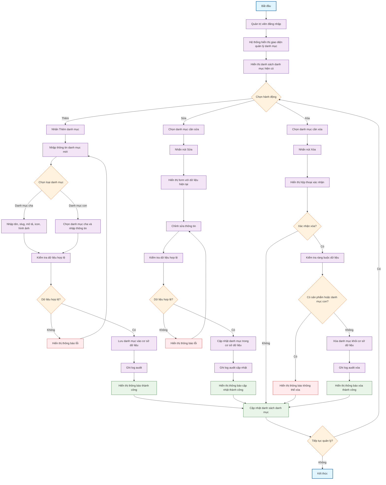

# Sơ đồ hoạt động quản lý danh mục

```mermaid
flowchart TD
    A[Bắt đầu] --> B[Quản trị viên đăng nhập]
    B --> C[Hệ thống hiển thị giao diện quản lý danh mục]
    C --> D[Hiển thị danh sách danh mục hiện có]
    D --> E{Chọn hành động}

    %% Luồng thêm danh mục
    E -->|Thêm| F[Nhấn Thêm danh mục]
    F --> G[Nhập thông tin danh mục mới]
    G --> H{Chọn loại danh mục}
    H -->|Danh mục cha| I[Nhập tên, slug, mô tả, icon, hình ảnh]
    H -->|Danh mục con| J[Chọn danh mục cha và nhập thông tin]

    I --> K[Kiểm tra dữ liệu hợp lệ]
    J --> K
    K --> L{Dữ liệu hợp lệ?}
    L -->|Không| M[Hiển thị thông báo lỗi]
    M --> G
    L -->|Có| N[Lưu danh mục vào cơ sở dữ liệu]
    N --> O[Ghi log audit]
    O --> P[Hiển thị thông báo thành công]
    P --> Q[Cập nhật danh sách danh mục]

    %% Luồng sửa danh mục
    E -->|Sửa| R[Chọn danh mục cần sửa]
    R --> S[Nhấn nút Sửa]
    S --> T[Hiển thị form với dữ liệu hiện tại]
    T --> U[Chỉnh sửa thông tin]
    U --> V[Kiểm tra dữ liệu hợp lệ]
    V --> W{Dữ liệu hợp lệ?}
    W -->|Không| X[Hiển thị thông báo lỗi]
    X --> U
    W -->|Có| Y[Cập nhật danh mục trong cơ sở dữ liệu]
    Y --> Z[Ghi log audit cập nhật]
    Z --> AA[Hiển thị thông báo cập nhật thành công]
    AA --> Q

    %% Luồng xóa danh mục
    E -->|Xóa| BB[Chọn danh mục cần xóa]
    BB --> CC[Nhấn nút Xóa]
    CC --> DD[Hiển thị hộp thoại xác nhận]
    DD --> EE{Xác nhận xóa?}
    EE -->|Không| Q
    EE -->|Có| FF[Kiểm tra ràng buộc dữ liệu]
    FF --> GG{Có sản phẩm hoặc danh mục con?}
    GG -->|Có| HH[Hiển thị thông báo không thể xóa]
    HH --> Q
    GG -->|Không| II[Xóa danh mục khỏi cơ sở dữ liệu]
    II --> JJ[Ghi log audit xóa]
    JJ --> KK[Hiển thị thông báo xóa thành công]
    KK --> Q

    %% Luồng quay lại và kết thúc
    Q --> LL{Tiếp tục quản lý?}
    LL -->|Có| E
    LL -->|Không| MM[Kết thúc]

    %% Styling
    classDef startEnd fill:#e1f5fe,stroke:#01579b,stroke-width:2px
    classDef process fill:#f3e5f5,stroke:#4a148c,stroke-width:1px
    classDef decision fill:#fff3e0,stroke:#e65100,stroke-width:1px
    classDef error fill:#ffebee,stroke:#c62828,stroke-width:1px
    classDef success fill:#e8f5e8,stroke:#1b5e20,stroke-width:1px

    class A,MM startEnd
    class B,C,D,F,G,I,J,K,N,O,R,S,T,U,V,Y,Z,BB,CC,DD,FF,II,JJ process
    class E,H,L,W,EE,GG,LL decision
    class M,X,HH error
    class P,AA,KK,Q success
```

**Lưu ý:** Vẽ bằng Mermaid
