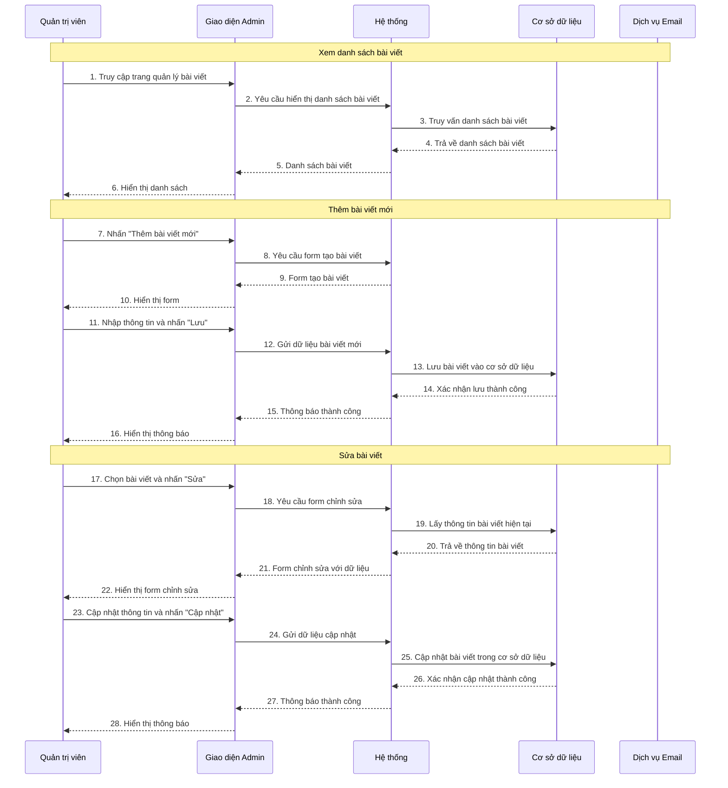
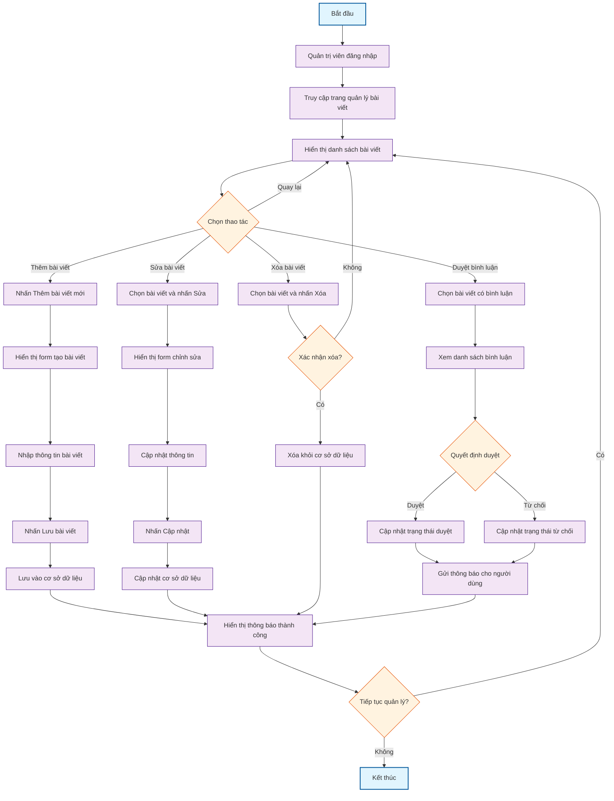

# 1. Use case chi tiết quản lý bài viết

**Tên Use case:** Quản lý bài viết

**Actor:** Quản trị viên

**Mô tả:** Quản trị viên quản lý các bài viết trên website bao gồm tạo, sửa, xóa và duyệt bài viết.

**Pre-conditions:**

- Quản trị viên đã đăng nhập vào hệ thống
- Có quyền truy cập vào chức năng quản lý bài viết

**Post-conditions:**

- **Success:** Bài viết được quản lý thành công, cơ sở dữ liệu được cập nhật
- **Fail:** Hệ thống hiển thị thông báo lỗi

**Luồng sự kiện chính:**

1. Quản trị viên chọn chức năng "Quản lý bài viết"
2. Hệ thống hiển thị danh sách bài viết
3. Quản trị viên chọn thao tác cần thực hiện
4. Hệ thống xử lý yêu cầu và hiển thị kết quả

**Include Use Case:** Đăng nhập

**Extend Use Case:**

- Thêm bài viết
- Sửa bài viết
- Xóa bài viết
- Duyệt bình luận

**Luồng sự kiện phụ:**
Quản trị viên thực hiện chức năng khác, hệ thống điều hướng sang giao diện tương ứng.

## `<Extend Use Case>`

### Thêm bài viết

**Actor:** Quản trị viên

1. Actor nhấn nút "Thêm bài viết mới"
2. Hệ thống hiển thị form tạo bài viết
3. Actor nhập thông tin bài viết (tiêu đề, nội dung, hình ảnh, danh mục)
4. Actor nhấn nút "Lưu bài viết"
5. Hệ thống lưu bài viết vào cơ sở dữ liệu
6. Hệ thống hiển thị thông báo thành công

### Sửa bài viết

**Actor:** Quản trị viên

1. Actor chọn bài viết cần sửa từ danh sách
2. Actor nhấn nút "Chỉnh sửa"
3. Hệ thống hiển thị form chỉnh sửa với thông tin hiện tại
4. Actor cập nhật thông tin cần thiết
5. Actor nhấn nút "Cập nhật"
6. Hệ thống cập nhật bài viết trong cơ sở dữ liệu
7. Hệ thống hiển thị thông báo thành công

### Xóa bài viết

**Actor:** Quản trị viên

1. Actor chọn bài viết cần xóa từ danh sách
2. Actor nhấn nút "Xóa"
3. Hệ thống hiển thị hộp thoại xác nhận
4. Actor xác nhận xóa bài viết
5. Hệ thống xóa bài viết khỏi cơ sở dữ liệu
6. Hệ thống hiển thị thông báo thành công

### Duyệt bình luận

**Actor:** Quản trị viên

1. Actor chọn bài viết có bình luận cần duyệt
2. Actor xem danh sách bình luận chưa duyệt
3. Actor chọn bình luận và quyết định duyệt hoặc từ chối
4. Hệ thống cập nhật trạng thái bình luận
5. Hệ thống gửi thông báo cho người dùng (nếu cần)

## `<Include Use Case>`

### Đăng nhập

**Actor:** Quản trị viên

1. Actor nhập thông tin đăng nhập
2. Actor nhấn nút "Đăng nhập"
3. Hệ thống kiểm tra thông tin
4. Nếu hợp lệ, chuyển đến giao diện quản lý bài viết
5. Nếu không hợp lệ, hiển thị thông báo lỗi

# 2. Sơ đồ tuần tự quản lý bài viết

**Lưu ý:** Vẽ bằng Mermaid

# 3. Sơ đồ hoạt động quản lý bài viết

**Lưu ý:** Vẽ bằng Mermaid
