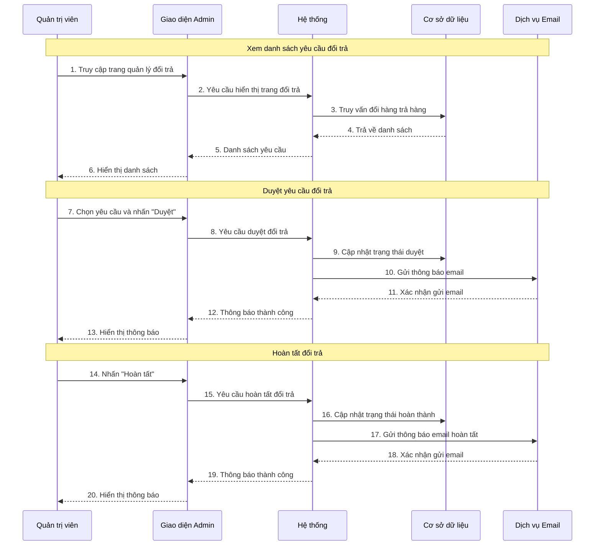

# 1. Use case chi tiết quản lý đổi hàng trả hàng

**Tên Use case:** Quản lý đổi hàng trả hàng

**Actor:** Quản trị viên

**Mô tả:** Quản trị viên xử lý các yêu cầu đổi hàng/trả hàng từ khách hàng.

**Pre-conditions:**

- Quản trị viên đã đăng nhập vào hệ thống
- Có yêu cầu đổi hàng/trả hàng cần xử lý

**Post-conditions:**

- **Success:** Yêu cầu được xử lý thành công, trạng thái được cập nhật
- **Fail:** Hệ thống hiển thị thông báo lỗi

**Luồng sự kiện chính:**

1. Quản trị viên chọn chức năng "Quản lý đổi hàng trả hàng"
2. Hệ thống hiển thị danh sách yêu cầu đổi hàng/trả hàng
3. Quản trị viên chọn một yêu cầu để xử lý
4. Hệ thống hiển thị chi tiết yêu cầu

**Include Use Case:** Đăng nhập

**Extend Use Case:**

- Duyệt yêu cầu đổi trả
- Từ chối yêu cầu đổi trả
- Hoàn tất đổi trả

**Luồng sự kiện phụ:**
Quản trị viên thực hiện chức năng khác, hệ thống điều hướng sang giao diện tương ứng.

## <Extend Use Case>

### Duyệt yêu cầu đổi trả

**Actor:** Quản trị viên

1. Actor chọn yêu cầu có trạng thái "PENDING"
2. Actor nhấn nút "Duyệt yêu cầu"
3. Hệ thống cập nhật trạng thái thành "APPROVED"
4. Hệ thống gửi email thông báo cho khách hàng

### Từ chối yêu cầu đổi trả

**Actor:** Quản trị viên

1. Actor chọn yêu cầu có trạng thái "PENDING"
2. Actor nhấn nút "Từ chối yêu cầu"
3. Actor nhập lý do từ chối
4. Hệ thống cập nhật trạng thái thành "REJECTED"
5. Hệ thống gửi email thông báo từ chối

### Hoàn tất đổi trả

**Actor:** Quản trị viên

1. Actor chọn yêu cầu có trạng thái "APPROVED"
2. Actor nhấn nút "Hoàn tất"
3. Hệ thống cập nhật trạng thái thành "COMPLETED"
4. Hệ thống xử lý hoàn tiền và gửi email xác nhận

## <Include Use Case>

### Đăng nhập

**Actor:** Quản trị viên

1. Actor nhập thông tin đăng nhập
2. Actor nhấn nút "Đăng nhập"
3. Hệ thống kiểm tra thông tin
4. Nếu hợp lệ, chuyển đến giao diện quản lý
5. Nếu không hợp lệ, hiển thị thông báo lỗi

# 2. Sơ đồ tuần tự quản lý đổi hàng trả hàng



**Lưu ý:** Vẽ bằng Mermaid

# 3. Sơ đồ hoạt động quản lý đổi hàng trả hàng

```mermaid
flowchart TD
    A[Bắt đầu] --> B[Quản trị viên đăng nhập]
    B --> C[Truy cập trang quản lý đổi trả]
    C --> D[Hiển thị danh sách yêu cầu]
    D --> E[Chọn yêu cầu cụ thể]
    E --> F{Quyết định xử lý}

    F -->|Duyệt| G[Nhấn "Duyệt yêu cầu"]
    F -->|Từ chối| H[Nhấn "Từ chối yêu cầu"]
    F -->|Hoàn tất| I[Nhấn "Hoàn tất"]
    F -->|Quay lại| D

    %% Luồng duyệt yêu cầu
    G --> J[Cập nhật trạng thái duyệt]
    J --> K[Gửi thông báo email]
    K --> L[Hiển thị thông báo thành công]

    %% Luồng từ chối yêu cầu
    H --> M[Nhập lý do từ chối]
    M --> N[Cập nhật trạng thái từ chối]
    N --> O[Gửi thông báo email từ chối]
    O --> L

    %% Luồng hoàn tất
    I --> P{Kiểm tra trạng thái}
    P -->|Đã duyệt| Q[Cập nhật trạng thái hoàn thành]
    P -->|Chưa duyệt| R[Hiển thị lỗi trạng thái]
    R --> E

    Q --> S[Xử lý hoàn tiền]
    S --> T[Gửi thông báo email hoàn tất]
    T --> L

    %% Kết thúc
    L --> U{Tiếp tục xử lý?}
    U -->|Có| D
    U -->|Không| V[Kết thúc]

    %% Styling
    classDef startEnd fill:#e1f5fe,stroke:#01579b,stroke-width:2px
    classDef process fill:#f3e5f5,stroke:#4a148c,stroke-width:1px
    classDef decision fill:#fff3e0,stroke:#e65100,stroke-width:1px
    classDef error fill:#ffebee,stroke:#c62828,stroke-width:1px

    class A,V startEnd
    class B,C,D,E,G,H,I,J,K,L,M,N,O,Q,S,T process
    class F,P,U decision
    class R error
```

**Lưu ý:** Vẽ bằng Mermaid
