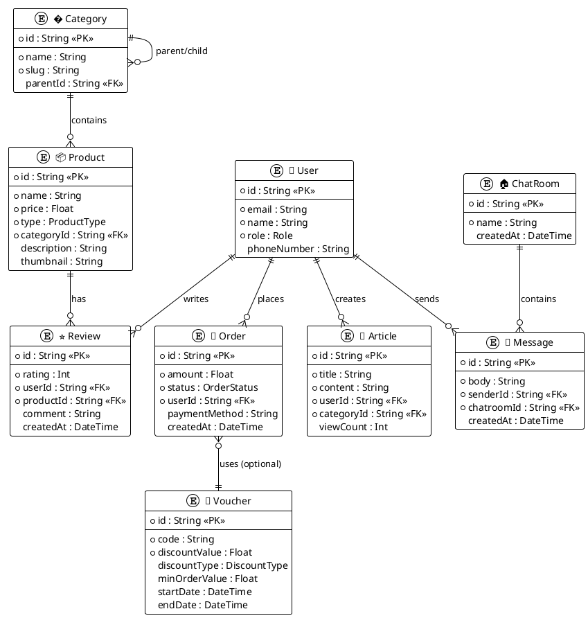
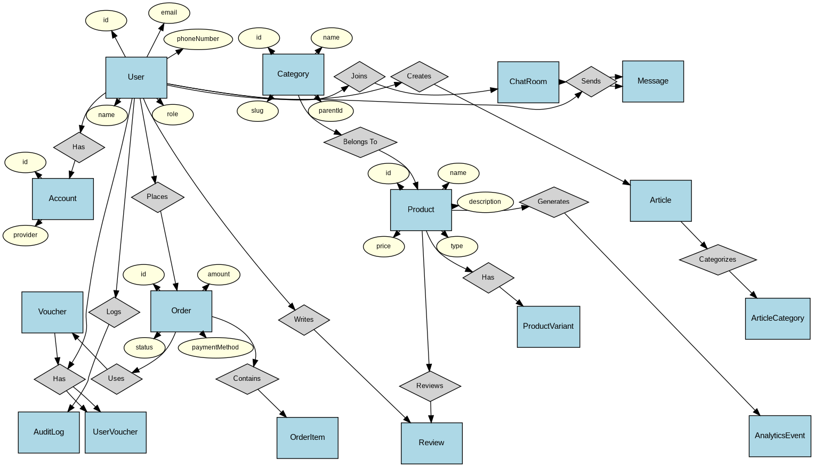

# 3.1.1 Mức ý niệm

## � Danh sách Entities từ Schema.prisma

### 👤 **User Management (2 entities):**

1. **User** - Người dùng hệ thống
2. **Account** - Tài khoản xác thực (OAuth)

### 📦 **Product System (5 entities):**

3. **Product** - Sản phẩm
4. **Category** - Danh mục sản phẩm (có phân cấp)
5. **ProductVariant** - Biến thể sản phẩm
6. **ProductAttribute** - Thuộc tính sản phẩm
7. **AttributeValue** - Giá trị thuộc tính

### 🛒 **Order & Payment (5 entities):**

8. **Order** - Đơn hàng
9. **Voucher** - Mã giảm giá
10. **UserVoucher** - Voucher của người dùng
11. **Promotion** - Chương trình khuyến mãi
12. **ProductPromotion** - Khuyến mãi sản phẩm

### 💬 **Communication (2 entities):**

13. **ChatRoom** - Phòng chat
14. **Message** - Tin nhắn

### 📝 **Content Management (4 entities):**

15. **Article** - Bài viết
16. **ArticleCategory** - Danh mục bài viết
17. **Review** - Đánh giá sản phẩm
18. **ArticleReview** - Bình luận bài viết

### ⚙️ **System & Analytics (8 entities):**

19. **Notification** - Thông báo
20. **AnalyticsEvent** - Sự kiện phân tích
21. **AuditLog** - Nhật ký hệ thống
22. **EmailCampaign** - Chiến dịch email
23. **ReturnRequest** - Yêu cầu trả hàng
24. **Banner** - Banner quảng cáo
25. **AdminSettings** - Cài đặt admin
26. **ReportLog** - Nhật ký báo cáo

---

## 🔗 **Key Relationships:**

### **User-centric:**

- User **1:N** Account
- User **1:N** Order
- User **1:N** Review, ArticleReview
- User **1:N** Message
- User **1:N** Notification
- User **1:N** UserVoucher
- User **1:N** ReturnRequest

### **Product-centric:**

- Category **1:N** Product
- Category **1:N** Category (self-reference)
- Product **1:N** ProductVariant
- Product **1:N** ProductAttribute
- Product **1:N** Review
- ProductAttribute **1:N** AttributeValue

### **Order-centric:**

- Order **N:1** Voucher
- Voucher **1:N** UserVoucher
- Promotion **1:N** ProductPromotion
- ProductPromotion **N:1** Product

### **Communication:**

- ChatRoom **1:N** Message
- User **N:M** ChatRoom

### **Content:**

- ArticleCategory **1:N** Article
- Article **1:N** ArticleReview
- ArticleReview **1:N** ArticleReview (self-reference)

---

---

## 🎨 **PlantUML ERD Diagram - Improved Version**

### **📸 Kết quả sơ đồ cũ (quá phức tạp):**

---

### **🎯 Sơ đồ ERD Đầy Đủ - Academic Style (Không Icons)**

---

### **🔧 Sơ đồ ERD Với Layout Cải Tiến**

---

### **📋 Sơ đồ ERD Chuẩn Academic - Theo Mẫu Internet Sales Model**

```plantuml
@startdot
digraph ER {
    fontname="Arial"
    node [fontname="Arial"]
    edge [fontname="Arial"]
    layout=neato
    bgcolor=white
    overlap=false
    splines=true

    // === LEGEND ===
    subgraph cluster_legend {
        label="Entity Relationship Diagram - E-Commerce System"
        style=filled
        fillcolor=white

        legend_entity [label="Entity" shape=box style=filled fillcolor=lightblue pos="0,12!"]
        legend_relationship [label="Relationship" shape=diamond style=filled fillcolor=lightgray pos="2,12!"]
        legend_attribute [label="Attribute" shape=ellipse style=filled fillcolor=lightyellow pos="4,12!"]

        legend_one [label="= One" shape=plaintext pos="6,12.5!"]
        legend_many [label="= Many" shape=plaintext pos="6,12!"]
        legend_optional [label="= Zero or more, Optional" shape=plaintext pos="6,11.5!"]
    }

    // === ENTITIES ===
    node [shape=box,style=filled,fillcolor=lightblue,fontsize=11,width=1.5,height=0.8]

    User [label="User" pos="2,10!"]
    Product [label="Product" pos="8,10!"]
    Category [label="Category" pos="12,10!"]
    Order [label="Order" pos="2,6!"]
    OrderItem [label="OrderItem" pos="6,6!"]
    Voucher [label="Voucher" pos="10,6!"]
    Review [label="Review" pos="8,2!"]
    ProductVariant [label="ProductVariant" pos="12,6!"]
    CartItem [label="CartItem" pos="4,2!"]

    // === RELATIONSHIPS ===
    node [shape=diamond,style=filled,fillcolor=lightgray,fontsize=10,width=1.2,height=0.6]

    Places [label="Places" pos="2,8!"]
    Contains [label="Contains" pos="4,6!"]
    Uses [label="Uses" pos="6,6!"]
    Writes [label="Writes" pos="5,4!"]
    BelongsTo [label="Belongs To" pos="10,10!"]
    HasVariant [label="Has Variant" pos="10,8!"]
    AddedTo [label="Added To" pos="3,4!"]
    Reviews [label="Reviews" pos="8,4!"]

    // === KEY ATTRIBUTES (Primary Keys) ===
    node [shape=ellipse,style=filled,fillcolor=gold,fontsize=9,width=0.8,height=0.4]

    user_id [label="id" pos="1,11!"]
    product_id [label="id" pos="7,11!"]
    category_id [label="id" pos="13,11!"]
    order_id [label="id" pos="1,7!"]
    orderitem_id [label="id" pos="5,7!"]
    voucher_id [label="id" pos="11,7!"]
    review_id [label="id" pos="7,1!"]
    variant_id [label="id" pos="13,7!"]
    cart_id [label="id" pos="3,1!"]

    // === REGULAR ATTRIBUTES ===
    node [shape=ellipse,style=filled,fillcolor=lightyellow,fontsize=9,width=0.8,height=0.4]

    // User attributes (đầy đủ từ Prisma schema)
    user_email [label="email" pos="0.5,10.5!"]
    user_name [label="name" pos="0.5,9.5!"]
    user_role [label="role" pos="3,11!"]
    user_phone [label="phoneNumber" pos="3,9.5!"]
    user_password [label="hashedPassword" pos="0.5,11.5!"]
    user_verified [label="emailVerified" pos="3,10.5!"]
    user_image [label="image" pos="1,12!"]
    user_created [label="createdAt" pos="1,8.5!"]
    user_updated [label="updatedAt" pos="3,8.5!"]

    // Product attributes (đầy đủ từ Prisma schema)
    prod_name [label="name" pos="6.5,10.5!"]
    prod_desc [label="description" pos="6.5,9.5!"]
    prod_price [label="price" pos="9,11!"]
    prod_brand [label="brand" pos="9,9.5!"]
    prod_type [label="productType" pos="7,12!"]
    prod_stock [label="inStock" pos="9,10.5!"]
    prod_priority [label="priority" pos="7,8.5!"]
    prod_deleted [label="isDeleted" pos="9,8.5!"]
    prod_deleted_at [label="deletedAt" pos="6.5,8.5!"]
    prod_deleted_by [label="deletedBy" pos="8,8!"]
    prod_thumbnail [label="thumbnail" pos="7,11.5!"]
    prod_gallery [label="galleryImages" pos="9,12!"]
    prod_created [label="createdAt" pos="6.5,12!"]
    prod_updated [label="updatedAt" pos="8.5,12!"]

    // Category attributes (đầy đủ từ Prisma schema)
    cat_name [label="name" pos="11.5,10.5!"]
    cat_slug [label="slug" pos="11.5,9.5!"]
    cat_desc [label="description" pos="13.5,10.5!"]
    cat_image [label="image" pos="13.5,9.5!"]
    cat_icon [label="icon" pos="11.5,11.5!"]
    cat_parent [label="parentId" pos="13.5,11.5!"]
    cat_created [label="createdAt" pos="11.5,8.5!"]
    cat_updated [label="updatedAt" pos="13.5,8.5!"]

    // Order attributes (đầy đủ từ Prisma schema)
    order_amount [label="amount" pos="0.5,6.5!"]
    order_status [label="status" pos="0.5,5.5!"]
    order_payment [label="paymentMethod" pos="3,7!"]
    order_address [label="address" pos="3,5.5!"]
    order_currency [label="currency" pos="0.5,7.5!"]
    order_delivery [label="deliveryStatus" pos="3,6.5!"]
    order_intent [label="paymentIntentId" pos="1,7.5!"]
    order_phone [label="phoneNumber" pos="1,5.5!"]
    order_shipping [label="shippingFee" pos="0.5,4.5!"]
    order_voucher_code [label="voucherCode" pos="3,4.5!"]
    order_original [label="originalAmount" pos="1,4.5!"]
    order_cancel_reason [label="cancelReason" pos="2,4!"]
    order_cancel_date [label="cancelDate" pos="3,4!"]
    order_note [label="note" pos="0.5,4!"]
    order_order_note [label="orderNote" pos="1,3.5!"]
    order_created [label="createdAt" pos="2,3.5!"]
    order_updated [label="updatedAt" pos="3,3.5!"]

    // OrderItem attributes (đầy đủ từ Prisma schema)
    item_quantity [label="quantity" pos="5,7.5!"]
    item_price [label="price" pos="5,5.5!"]
    item_total [label="totalPrice" pos="7,7!"]
    item_product [label="productId" pos="5,6.5!"]
    item_variant [label="productVariantId" pos="7,6.5!"]
    item_created [label="createdAt" pos="6,5!"]

    // Voucher attributes (đầy đủ từ Prisma schema)
    voucher_code [label="code" pos="9.5,6.5!"]
    voucher_discount [label="discountValue" pos="9.5,5.5!"]
    voucher_type [label="discountType" pos="11.5,6.5!"]
    voucher_min [label="minOrderValue" pos="11.5,5.5!"]
    voucher_name [label="name" pos="9.5,7.5!"]
    voucher_desc [label="description" pos="11.5,7.5!"]
    voucher_max [label="maxDiscountAmount" pos="9.5,4.5!"]
    voucher_limit [label="usageLimit" pos="11.5,4.5!"]
    voucher_used [label="usedCount" pos="10,4!"]
    voucher_start [label="startDate" pos="9,5!"]
    voucher_end [label="endDate" pos="12,5!"]
    voucher_active [label="isActive" pos="10,7!"]
    voucher_created [label="createdAt" pos="9,4!"]
    voucher_updated [label="updatedAt" pos="12,4!"]

    // Review attributes (đầy đủ từ Prisma schema)
    review_rating [label="rating" pos="7,2.5!"]
    review_comment [label="comment" pos="7,1.5!"]
    review_images [label="images" pos="9,2!"]
    review_verified [label="isVerified" pos="9,1!"]
    review_helpful [label="helpfulCount" pos="8,3!"]
    review_user [label="userId" pos="6.5,2!"]
    review_product [label="productId" pos="6.5,1!"]
    review_created [label="createdAt" pos="8,1!"]
    review_updated [label="updatedAt" pos="9,1.5!"]

    // ProductVariant attributes (đầy đủ từ Prisma schema)
    variant_sku [label="sku" pos="11.5,6.5!"]
    variant_price [label="price" pos="11.5,5.5!"]
    variant_stock [label="stock" pos="13.5,6.5!"]
    variant_attrs [label="attributes" pos="13.5,5.5!"]
    variant_thumbnail [label="thumbnail" pos="11.5,7.5!"]
    variant_gallery [label="galleryImages" pos="13.5,7.5!"]
    variant_active [label="isActive" pos="12,7!"]
    variant_created [label="createdAt" pos="11.5,4.5!"]
    variant_updated [label="updatedAt" pos="13.5,4.5!"]

    // CartItem attributes (đầy đủ từ Prisma schema)
    cart_quantity [label="quantity" pos="2.5,2.5!"]
    cart_price [label="price" pos="2.5,1.5!"]
    cart_attrs [label="attributes" pos="4.5,2.5!"]
    cart_user [label="userId" pos="2.5,3.5!"]
    cart_product [label="productId" pos="4.5,3.5!"]
    cart_variant [label="variantId" pos="3.5,3!"]
    cart_created [label="createdAt" pos="2.5,0.5!"]
    cart_updated [label="updatedAt" pos="4.5,0.5!"]

    // === ENTITY-RELATIONSHIP CONNECTIONS ===
    edge [color=black,fontsize=8]

    // Main relationships
    User -> Places [label="1"]
    Places -> Order [label="N"]

    Order -> Contains [label="1"]
    Contains -> OrderItem [label="N"]

    Order -> Uses [label="1"]
    Uses -> Voucher [label="1"]

    User -> Writes [label="1"]
    Writes -> Review [label="N"]

    Product -> Reviews [label="1"]
    Reviews -> Review [label="N"]

    Product -> BelongsTo [label="N"]
    BelongsTo -> Category [label="1"]

    Product -> HasVariant [label="1"]
    HasVariant -> ProductVariant [label="N"]

    User -> AddedTo [label="1"]
    AddedTo -> CartItem [label="N"]

    // === ATTRIBUTE CONNECTIONS ===
    edge [color=darkblue,fontsize=7]

    // User attributes (tất cả fields)
    User -> user_id [style=bold]
    User -> user_email
    User -> user_name
    User -> user_role
    User -> user_phone
    User -> user_password
    User -> user_verified
    User -> user_image
    User -> user_created
    User -> user_updated

    // Product attributes (tất cả fields)
    Product -> product_id [style=bold]
    Product -> prod_name
    Product -> prod_desc
    Product -> prod_price
    Product -> prod_brand
    Product -> prod_type
    Product -> prod_stock
    Product -> prod_priority
    Product -> prod_deleted
    Product -> prod_deleted_at
    Product -> prod_deleted_by
    Product -> prod_thumbnail
    Product -> prod_gallery
    Product -> prod_created
    Product -> prod_updated

    // Category attributes (tất cả fields)
    Category -> category_id [style=bold]
    Category -> cat_name
    Category -> cat_slug
    Category -> cat_desc
    Category -> cat_image
    Category -> cat_icon
    Category -> cat_parent
    Category -> cat_created
    Category -> cat_updated

    // Order attributes (tất cả fields)
    Order -> order_id [style=bold]
    Order -> order_amount
    Order -> order_status
    Order -> order_payment
    Order -> order_address
    Order -> order_currency
    Order -> order_delivery
    Order -> order_intent
    Order -> order_phone
    Order -> order_shipping
    Order -> order_voucher_code
    Order -> order_original
    Order -> order_cancel_reason
    Order -> order_cancel_date
    Order -> order_note
    Order -> order_order_note
    Order -> order_created
    Order -> order_updated

    // OrderItem attributes (tất cả fields)
    OrderItem -> orderitem_id [style=bold]
    OrderItem -> item_quantity
    OrderItem -> item_price
    OrderItem -> item_total
    OrderItem -> item_product
    OrderItem -> item_variant
    OrderItem -> item_created

    // Voucher attributes (tất cả fields)
    Voucher -> voucher_id [style=bold]
    Voucher -> voucher_code
    Voucher -> voucher_discount
    Voucher -> voucher_type
    Voucher -> voucher_min
    Voucher -> voucher_name
    Voucher -> voucher_desc
    Voucher -> voucher_max
    Voucher -> voucher_limit
    Voucher -> voucher_used
    Voucher -> voucher_start
    Voucher -> voucher_end
    Voucher -> voucher_active
    Voucher -> voucher_created
    Voucher -> voucher_updated

    // Review attributes (tất cả fields)
    Review -> review_id [style=bold]
    Review -> review_rating
    Review -> review_comment
    Review -> review_images
    Review -> review_verified
    Review -> review_helpful
    Review -> review_user
    Review -> review_product
    Review -> review_created
    Review -> review_updated

    // ProductVariant attributes (tất cả fields)
    ProductVariant -> variant_id [style=bold]
    ProductVariant -> variant_sku
    ProductVariant -> variant_price
    ProductVariant -> variant_stock
    ProductVariant -> variant_attrs
    ProductVariant -> variant_thumbnail
    ProductVariant -> variant_gallery
    ProductVariant -> variant_active
    ProductVariant -> variant_created
    ProductVariant -> variant_updated

    // CartItem attributes (tất cả fields)
    CartItem -> cart_id [style=bold]
    CartItem -> cart_quantity
    CartItem -> cart_price
    CartItem -> cart_attrs
    CartItem -> cart_user
    CartItem -> cart_product
    CartItem -> cart_variant
    CartItem -> cart_created
    CartItem -> cart_updated
}
@enddot
```

---

**✅ Cải tiến theo chuẩn ERD Academic:**

- 📐 **Entities** - Hình chữ nhật xanh (lightblue) chứa tên entity
- 🔷 **Relationships** - Hình thoi xám (lightgray) chứa tên relationship
- 🟡 **Key Attributes** - Hình oval vàng (gold) cho Primary Keys
- 🟨 **Regular Attributes** - Hình oval vàng nhạt (lightyellow) cho attributes thường
- 🔗 **Cardinality** - Hiển thị rõ ràng 1, N, M trên các đường kết nối
- 📍 **Layout** - Sử dụng neato layout với tọa độ cố định (pos) như hình mẫu
- 🎯 **Tách biệt rõ ràng** - Entities, Relationships, và Attributes là các thành phần độc lập

**🎨 Ký hiệu theo chuẩn ERD:**

- **Hình chữ nhật xanh** - Entities (User, Product, Order, etc.)
- **Hình thoi xám** - Relationships (Places, Contains, Uses, etc.)
- **Hình oval vàng đậm** - Primary Key attributes (id fields)
- **Hình oval vàng nhạt** - Regular attributes (name, email, price, etc.)
- **Đường kết nối đậm** - Primary Key connections
- **Đường kết nối thường** - Regular attribute connections

### **📋 Sơ đồ ERD Đầy Đủ - UML Style (Backup)**

```plantuml
@startuml
!theme plain
skinparam backgroundColor white
skinparam entity {
    BackgroundColor lightblue
    BorderColor darkblue
    FontSize 9
}

' === USER MANAGEMENT ===
entity "User" as User {
  * id : String <<PK>>
  --
  * email : String
  * name : String
  * role : Role
  phoneNumber : String
  hashedPassword : String
  emailVerified : DateTime
  image : String
  createdAt : DateTime
  updatedAt : DateTime
}

entity "Account" as Account {
  * id : String <<PK>>
  --
  * userId : String <<FK>>
  * type : String
  * provider : String
  * providerAccountId : String
  refresh_token : String
  access_token : String
  expires_at : Int
  token_type : String
  scope : String
  id_token : String
  session_state : String
}

' === PRODUCT SYSTEM ===
entity "Category" as Category {
  * id : String <<PK>>
  --
  * name : String
  * slug : String
  parentId : String <<FK>>
  description : String
  image : String
  isActive : Boolean
  createdAt : DateTime
  updatedAt : DateTime
}

entity "Product" as Product {
  * id : String <<PK>>
  --
  * name : String
  * description : String
  * brand : String
  * productType : ProductType
  * price : Float
  * categoryId : String <<FK>>
  * inStock : Int
  * priority : Int
  * createdAt : DateTime
  * updatedAt : DateTime
  * isDeleted : Boolean
  * deletedAt : DateTime
  * deletedBy : String
  * thumbnail : String
  * galleryImages : String[]
}

entity "ProductVariant" as ProductVariant {
  * id : String <<PK>>
  --
  * productId : String <<FK>>
  * sku : String
  * attributes : Json
  * price : Float
  * stock : Int
  * thumbnail : String
  * galleryImages : String[]
  * isActive : Boolean
  * createdAt : DateTime
  * updatedAt : DateTime
}

' === ORDER SYSTEM ===
entity "Order" as Order {
  * id : String <<PK>>
  --
  * userId : String <<FK>>
  * amount : Float
  * currency : String
  * status : OrderStatus
  * deliveryStatus : DeliveryStatus
  * paymentIntentId : String
  * phoneNumber : String
  * address : Address
  * paymentMethod : String
  * shippingFee : Float
  * voucherId : String <<FK>>
  * voucherCode : String
  * discountAmount : Float
  * originalAmount : Float
  * cancelReason : String
  * cancelDate : DateTime
  * note : String
  * orderNote : String
  * createdAt : DateTime
  * updatedAt : DateTime
}

entity "OrderItem" as OrderItem {
  * id : String <<PK>>
  --
  * orderId : String <<FK>>
  * productId : String <<FK>>
  * productVariantId : String <<FK>>
  * quantity : Int
  * price : Float
  * totalPrice : Float
  createdAt : DateTime
}

entity "Voucher" as Voucher {
  * id : String <<PK>>
  --
  * code : String
  * name : String
  * description : String
  * discountType : DiscountType
  * discountValue : Float
  * minOrderValue : Float
  * maxDiscountAmount : Float
  * usageLimit : Int
  * usedCount : Int
  * startDate : DateTime
  * endDate : DateTime
  * isActive : Boolean
  * createdAt : DateTime
  * updatedAt : DateTime
}

entity "UserVoucher" as UserVoucher {
  * id : String <<PK>>
  --
  * userId : String <<FK>>
  * voucherId : String <<FK>>
  * usedAt : DateTime
  createdAt : DateTime
}

' === CONTENT SYSTEM ===
entity "Review" as Review {
  * id : String <<PK>>
  --
  * userId : String <<FK>>
  * productId : String <<FK>>
  * rating : Int
  * comment : String
  * images : String[]
  * isVerified : Boolean
  * helpfulCount : Int
  * createdAt : DateTime
  * updatedAt : DateTime
}

entity "Article" as Article {
  * id : String <<PK>>
  --
  * title : String
  * content : String
  * excerpt : String
  * slug : String
  * userId : String <<FK>>
  * categoryId : String <<FK>>
  * thumbnail : String
  * viewCount : Int
  * isPublished : Boolean
  * publishedAt : DateTime
  * createdAt : DateTime
  * updatedAt : DateTime
}

entity "ArticleCategory" as ArticleCategory {
  * id : String <<PK>>
  --
  * name : String
  * slug : String
  * description : String
  * color : String
  * isActive : Boolean
  * createdAt : DateTime
  * updatedAt : DateTime
}

' === COMMUNICATION ===
entity "ChatRoom" as ChatRoom {
  * id : String <<PK>>
  --
  * name : String
  * description : String
  * isPrivate : Boolean
  * maxMembers : Int
  * createdBy : String <<FK>>
  * createdAt : DateTime
  * updatedAt : DateTime
}

entity "Message" as Message {
  * id : String <<PK>>
  --
  * body : String
  * senderId : String <<FK>>
  * chatroomId : String <<FK>>
  * messageType : MessageType
  * attachments : String[]
  * isRead : Boolean
  * replyToId : String <<FK>>
  * createdAt : DateTime
  * updatedAt : DateTime
}

' === ANALYTICS & AUDIT ===
entity "AnalyticsEvent" as AnalyticsEvent {
  * id : String <<PK>>
  --
  * userId : String <<FK>>
  * productId : String <<FK>>
  * eventType : EventType
  * sessionId : String
  * userAgent : String
  * ipAddress : String
  * referrer : String
  * createdAt : DateTime
}

entity "AuditLog" as AuditLog {
  * id : String <<PK>>
  --
  * userId : String <<FK>>
  * action : String
  * description : String
  * entityType : String
  * entityId : String
  * oldValues : Json
  * newValues : Json
  * ipAddress : String
  * userAgent : String
  * createdAt : DateTime
}

' === ADDITIONAL ENTITIES ===
entity "Banner" as Banner {
  * id : String <<PK>>
  --
  * title : String
  * description : String
  * imageUrl : String
  * linkUrl : String
  * isActive : Boolean
  * displayOrder : Int
  * startDate : DateTime
  * endDate : DateTime
  * createdAt : DateTime
  * updatedAt : DateTime
}

entity "AdminSettings" as AdminSettings {
  * id : String <<PK>>
  --
  * key : String
  * value : String
  * description : String
  * type : SettingType
  * isPublic : Boolean
  * createdAt : DateTime
  * updatedAt : DateTime
}

entity "EmailCampaign" as EmailCampaign {
  * id : String <<PK>>
  --
  * name : String
  * subject : String
  * content : String
  * templateId : String
  * targetAudience : Json
  * status : CampaignStatus
  * scheduledAt : DateTime
  * sentAt : DateTime
  * createdBy : String <<FK>>
  * createdAt : DateTime
  * updatedAt : DateTime
}

entity "Promotion" as Promotion {
  * id : String <<PK>>
  --
  * name : String
  * description : String
  * type : PromotionType
  * value : Float
  * conditions : Json
  * startDate : DateTime
  * endDate : DateTime
  * isActive : Boolean
  * createdAt : DateTime
  * updatedAt : DateTime
}

entity "ReportLog" as ReportLog {
  * id : String <<PK>>
  --
  * reportType : String
  * parameters : Json
  * generatedBy : String <<FK>>
  * filePath : String
  * status : ReportStatus
  * createdAt : DateTime
  * completedAt : DateTime
}

' === PRODUCT ATTRIBUTE SYSTEM ===
entity "ProductAttribute" as ProductAttribute {
  * id : String <<PK>>
  --
  * productId : String <<FK>>
  * name : String
  * label : String
  * type : AttributeType
  * displayType : DisplayType
  * isRequired : Boolean
  * isVariation : Boolean
  * position : Int
  * description : String
  * createdAt : DateTime
  * updatedAt : DateTime
}

entity "AttributeValue" as AttributeValue {
  * id : String <<PK>>
  --
  * attributeId : String <<FK>>
  * value : String
  * label : String
  * description : String
  * colorCode : String
  * imageUrl : String
  * priceAdjustment : Float
  * position : Int
  * isActive : Boolean
  * createdAt : DateTime
  * updatedAt : DateTime
}

' === NOTIFICATION SYSTEM ===
entity "Notification" as Notification {
  * id : String <<PK>>
  --
  * userId : String <<FK>>
  * productId : String <<FK>>
  * fromUserId : String <<FK>>
  * type : NotificationType
  * title : String
  * message : String
  * isRead : Boolean
  * createdAt : DateTime
  * updatedAt : DateTime
}

' === CART SYSTEM ===
entity "CartItem" as CartItem {
  * id : String <<PK>>
  --
  * userId : String <<FK>>
  * productId : String <<FK>>
  * variantId : String <<FK>>
  * quantity : Int
  * price : Float
  * attributes : Json
  * createdAt : DateTime
  * updatedAt : DateTime
}

' === RELATIONSHIPS ===
User ||--o{ Account : "has"
User ||--o{ Order : "places"
User ||--o{ Review : "writes"
User ||--o{ Article : "creates"
User ||--o{ Message : "sends"
User ||--o{ UserVoucher : "has"
User ||--o{ AnalyticsEvent : "generates"
User ||--o{ AuditLog : "logs"
User ||--o{ ChatRoom : "creates"
User ||--o{ EmailCampaign : "creates"
User ||--o{ ReportLog : "generates"
User ||--o{ Notification : "receives"
User ||--o{ CartItem : "has"

Category ||--o{ Product : "contains"
Category ||--o{ Category : "parent/child"
ArticleCategory ||--o{ Article : "categorizes"

Product ||--o{ ProductVariant : "has"
Product ||--o{ Review : "receives"
Product ||--o{ OrderItem : "ordered_as"
Product ||--o{ AnalyticsEvent : "tracked_for"
Product ||--o{ ProductAttribute : "has"
Product ||--o{ Notification : "triggers"
Product ||--o{ CartItem : "added_to_cart"

ProductAttribute ||--o{ AttributeValue : "has"
ProductVariant ||--o{ CartItem : "selected_as"

Order ||--o{ OrderItem : "contains"
Order }o--|| Voucher : "uses"

Voucher ||--o{ UserVoucher : "assigned_to"
Voucher ||--o{ Promotion : "applies_to"

ChatRoom ||--o{ Message : "contains"
Message }o--|| Message : "replies_to"

User ||--o{ Notification : "sends" [label="fromUser"]

@enduml
```

---

**✅ Cải tiến so với phiên bản cũ:**

- 🎯 **20+ entities đầy đủ** - Bao gồm tất cả business logic
- 📐 **Layout có tổ chức** - Nhóm theo chức năng (User, Product, Order, Content, Analytics)
- 🔗 **Relationships chi tiết** - Hiển thị đầy đủ cardinality và foreign keys
- 🎨 **3 phiên bản** - Tối giản, DOT layout, và Academic style đầy đủ
- 📝 **Tất cả attributes** - Bao gồm cả optional fields và metadata
- 🚫 **Không icons** - Theo chuẩn academic ERD diagram
- �️ **Cấu trúc rõ ràng** - Primary Keys, Foreign Keys, Data types

**📊 Thống kê entities:**

- **User Management**: User, Account, Notification (3 entities)
- **Product System**: Category, Product, ProductVariant, ProductAttribute, AttributeValue (5 entities)
- **Order System**: Order, OrderItem, Voucher, UserVoucher, CartItem (5 entities)
- **Content System**: Review, Article, ArticleCategory (3 entities)
- **Communication**: ChatRoom, Message (2 entities)
- **Analytics & Audit**: AnalyticsEvent, AuditLog (2 entities)
- **Additional**: Banner, AdminSettings, EmailCampaign, Promotion, ReportLog (5 entities)
- **Tổng cộng**: **25 entities** với đầy đủ attributes và relationships theo Prisma schema

**💡 Hướng dẫn sử dụng:**

1. Copy code vào [PlantUML Online](https://www.plantuml.com/plantuml/uml/)
2. Chọn phiên bản phù hợp:
   - **Tối giản** - 9 entities chính (dễ đọc, presentation)
   - **DOT Layout** - 16 entities với layout tự động (development)
   - **Academic Style** - 25 entities đầy đủ theo Prisma schema (báo cáo chuyên nghiệp)
3. Export PNG/SVG chất lượng cao cho báo cáo
